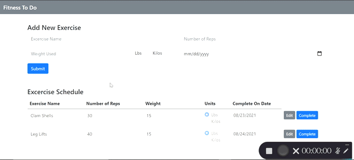

# Fitness To Do

This project is a single web page that interacts with a database in order to store exercises to be completed by the user. The backend is built using Node.js, Express.js, and mySQL as the database.
The front end web page allows a user add a new exercises to be completed via a form, edit created exercises, and mark them complete when finished. The front end uses, HTML, Bootstrap, and client side JavaScript. 

All interactions between the front end and back end are done via AJAX requests. The webpage is never reloaded and all form submission, building of the todo table, and completing activities is done by client side JavaScript and DOM manipulation. 

This project was built as a tool to keep track of my physical therapy exercises after I had knee surgery. It was built to practice using AJAX requests and handling the returned JSON as well as practice with database interactions. 

For a list of dependencies see the [package.json](package.json) file.

To view the client side JavaScript and AJAX requests see the [script.js](script.js) file.

To view the backend Node.js, Express.js, and mySQL file see the [index.js](index.js) file.

The gif below display the webpage. It demonstrates how to add a new exercise using the form. It then goes to show how a user is able to edit any added exercise. Lastly when an exercise has been completed, pressing the complete button removes the exercise from the list of to do items. 

